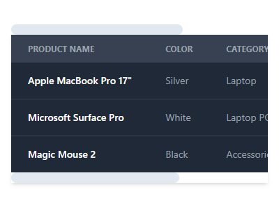

## Scrollbar On Top and Bottom of Table

<p align="center">
    
</p>

## Table of Contents

- [Steps Add Scrollbar On Top and Bottom of Table](#steps-add-scrollbar-on-top-and-bottom-of-table)
- [Running Scrollbar On Top and Bottom of Table](#running-project-scroll-on-top-and-bottom-of-table)

## Steps Add Scrollbar On Top and Bottom of Table

You can add a scrollbar on top and bottom of a table by using the following code:

Add this code above the table code.

```html
<div id="wrapper-first-scroll">
  <div id="div-scroll"></div>
</div>
```

Add an id with the name wrapper-second-scroll to the table wrapper.

```html
id="wrapper-second-scroll"
```

Add the following CSS code to the style tag.

```css
#wrapper-first-scroll,
#wrapper-second-scroll {
  width: auto;
  border: none 0px;
  overflow-x: scroll;
  overflow-y: hidden;
}

#wrapper-scroll {
  height: auto;
}

#wrapper-second-scroll {
  height: auto;
}

#div-scroll {
  width: 550px;
  height: 20px;
}
```

### Running Project Scroll On Top and Bottom of Table

```bash
npm install
```

```bash
npm build
```

## Reference

- [Stackoverflow](https://stackoverflow.com/a/47038108)
